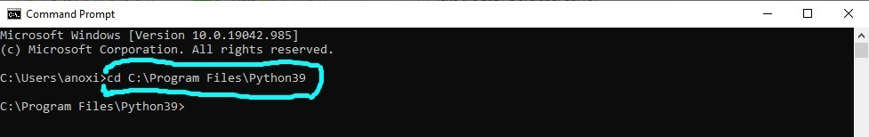

# Installing and running Python

## How to install Python 

* Go to [**Python.org**](Python.org/downloads).
* Click **"Download Python 3.9.5"** or choose a different OS:

* Save file in preferred location:

* Run the **.exe** file. 
* Click "**Customize installation**":

* Leave **Optional Features** as is and click **"Next"**:

* In **Advanced Options** tick **"Install for all users"** and click **"Install"**:

* Click **"Yes"** and wait for install:

* **Setup was successful** should display after install. Click **"Close"**:

* Search for and open **Command Prompt**:

* Type **"cd C:\Program Files\Python39"** (or change directory to your Python locatation):

* Type **"python --version"**, and the installed version should be displayed:

## How to run a program via IDLE

We need an [**IDE**](https://www.codecademy.com/articles/what-is-an-ide) to make programming easier. Python comes with its own one, **IDLE**:

* Search for the folder where you saved **finance_calculators.py** (or any other Python file).
* Right click on the icon, and choose **"Edit with IDLE"**.
* You are now able to edit the code:

* The file should open. Click the **"Run"** tab and **"Run Module"**:

* You should now see program running in the **IDLE** console:

And that's it - you're all set up! 
