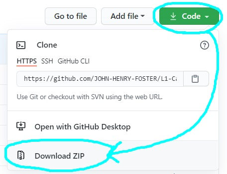

# L1-Capstone1 
                    
    	 

This project is an investment and bond calculator. It allows users to easily calculate expected investment returns and montly home-loan repayments, using their own criteria. 
It aims to provide a basic financial tool/component to individuals, developers, organizations, and sites.

## How does it work?
* The user chooses investment or bond.
* The user enters their investment/bond amounts, interest rate & time period & finds an answer.
* For investments, users have the option of choosing either simple or complound interest.

## Who can use it? 
This open source software is free to use by anyone. Apart from personal use, it can also benefit:
* Investment and finance app/site developers.
* Existing banking, investment, real estate, and personal finance sites.
* Beginner developers who might want to replicate or edit the project.

We also welcome everyone who would like to continue improving this program!
	
## To run or edit this program

* You need **Python**. 
* If you don't have Python, go [**here**](PYTHONINSTALL.md#installing-and-running-python).
* Else, simply click **"Code"** and **"Download ZIP"** above:
 
.

* Run and edit the file using [**these**](PYTHONINSTALL.md#installing-and-running-python) steps.
	  
## How you can help

* Contact us if you have any suggestions/questions.
* Write up any issues [**here**](issues).
* Read our [**Contribution Guide**](CONTRIBUTING.md#contributing), which contains everything you need to know about helping to improve the project. 
* We explicity welcome non-developer input.

## Licence

This project has been licenced under [**GPLv3**](https://www.gnu.org/licenses/gpl-3.0.html).  

It is [free](https://www.gnu.org/philosophy/free-sw.html), [open source](https://opensource.org/osd), [copyleft](https://www.gnu.org/licenses/copyleft.en.html) software: 
Anyone can use, edit, and redistribute it in any way they see fit, but it must be redistributed under the same licence, and certain restrictions apply.

For more information, please see [**Licence**](LICENCE.md#licence).

## Contact us

The fastest way to get hold of us is always via [email](mailto:anoxicdrollie@gmail.com).

Shoot us a mail, and we'll get back to you as soon as time allows - we would love to hear from you!

